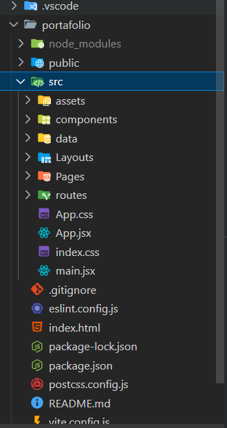

# 🏛️ Arquitectura del Proyecto: Portafolio Web Profesional

Este documento describe la estructura de carpetas y las decisiones de arquitectura tomadas para este portafolio web construido con React, Vite y Tailwind CSS.

## Estructura General de Carpetas

El proyecto sigue una estructura estándar para aplicaciones React, priorizando la separación de intereses:

## Descripción de Carpetas Clave en `/src`

* **`/assets`**: Contiene todos los archivos multimedia estáticos (imágenes, logos) que se importan directamente en los componentes.
* **`/components`**: Alberga componentes React reutilizables que no son páginas completas.
    * **`/ui`**: Subcarpeta para componentes de UI muy genéricos y desacoplados de la lógica de negocio (ej. `ProjectCarousel.jsx`).
* **`/data`**: Centraliza los datos estáticos de la aplicación (como `proyectosData.js`) para separarlos de la lógica de presentación. Esto facilita las actualizaciones.
* **`/Layouts`**: Contiene componentes que definen la estructura principal de la interfaz, como `Navbar.jsx`, `Footer.jsx` y `MainLayout.jsx` (que usualmente incluye el Navbar, Footer y el `<Outlet />` para las páginas).
* **`/Pages`**: Cada archivo aquí representa una vista o página completa de la aplicación (ej. `Home.jsx`, `AboutMe.jsx`, `ViewProject.jsx`). Son los componentes que se renderizan a través de las rutas.
* **`/routes`**: Define la configuración del enrutamiento de la aplicación (`react-router-dom`), mapeando las URLs a los componentes de `/Pages`.

## Decisiones Arquitectónicas

1.  **React + Vite:** Se eligió por su excelente rendimiento en desarrollo (HMR rápido) y *builds* optimizados.
2.  **Tailwind CSS:** Para un desarrollo rápido de UI mediante clases de utilidad, siguiendo el Kit de UI definido.
3.  **React Router DOM:** Para manejar la navegación entre páginas (`Home`, `AboutMe`, `ViewProject`, etc.).
4.  **Separación de Datos (`/data`):** Para mantener el contenido desacoplado de los componentes de UI, facilitando futuras actualizaciones.
5.  **Componentización:** Se prioriza la creación de componentes reutilizables (`/components`, `/Layouts`) para mantener el código DRY (Don't Repeat Yourself).